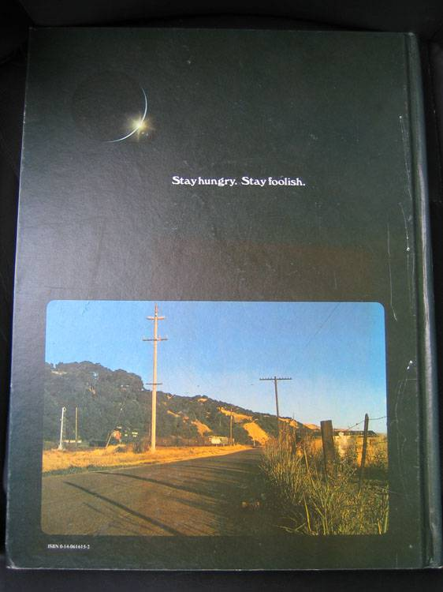

# Stay hungry. Stay foolish.

> "Stewart和他的人出了好几期《地球产品目录》（Whole Earth Catalog），然后不打算再出了，他们推出了最后一期。那时是70年代中期，我跟你们一样大。那一期的>  封底有一张照片，上面是清晨的乡间道路，就是那种如果你喜欢漫游，你会经过的道路。照片下面有一句话：'Stay Hungry, Stay Foolish'。这是他们的临别赠言。
>  Stay Hungry. Stay Foolish. 我总是希望自己永远保持这个状态。现在你们即将毕业，我也把这句话送给你们。"
>                                                                                                --Steve Jobs
<!-- more -->

> "后来，我们就拿到了地球的太空照片，那是在一颗卫星上拍摄的，可以看到地球的完整一天，从日出到日落。我把照片排成那个顺序，我想表达一种连接，一方面是太阳
> 的阴影在地球表面的移动，另一方面是与此同时人们在地球上的经历，他们看到日出。我脑海中的画面是，一个漫游者日出时站在无名的路上，太阳升起来了，火车从旁边> 呼啸而过。这个年轻人的心情是如此自由，他有点饿（hungry），也知道得很清楚，自己对前面的道路一无所知（foolish）。"
>                                                                                               --Stewart Brand

